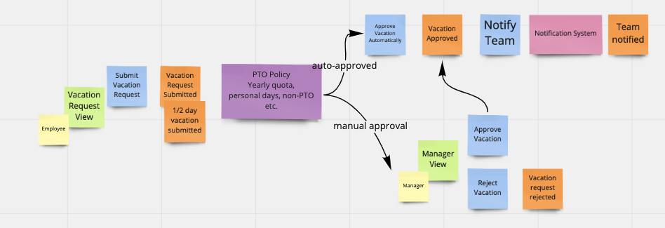
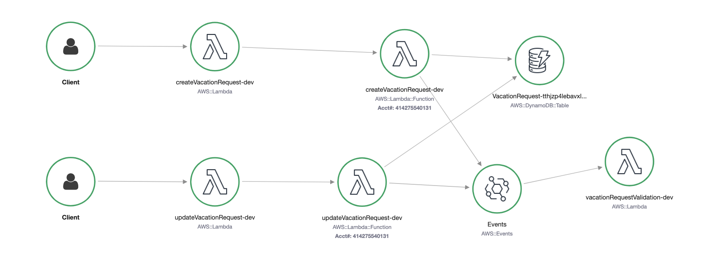
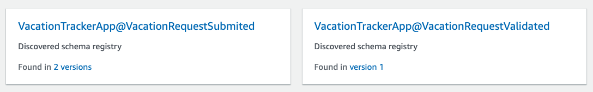
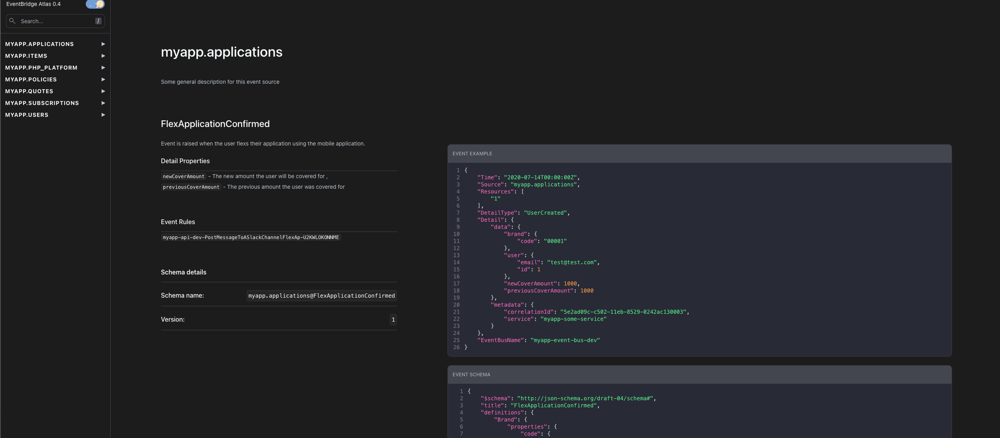
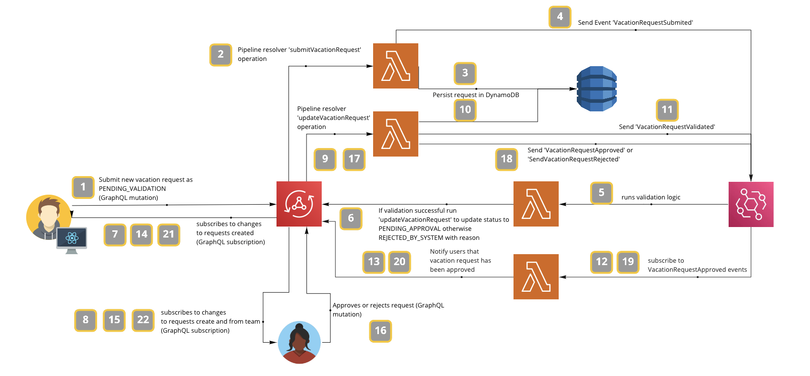
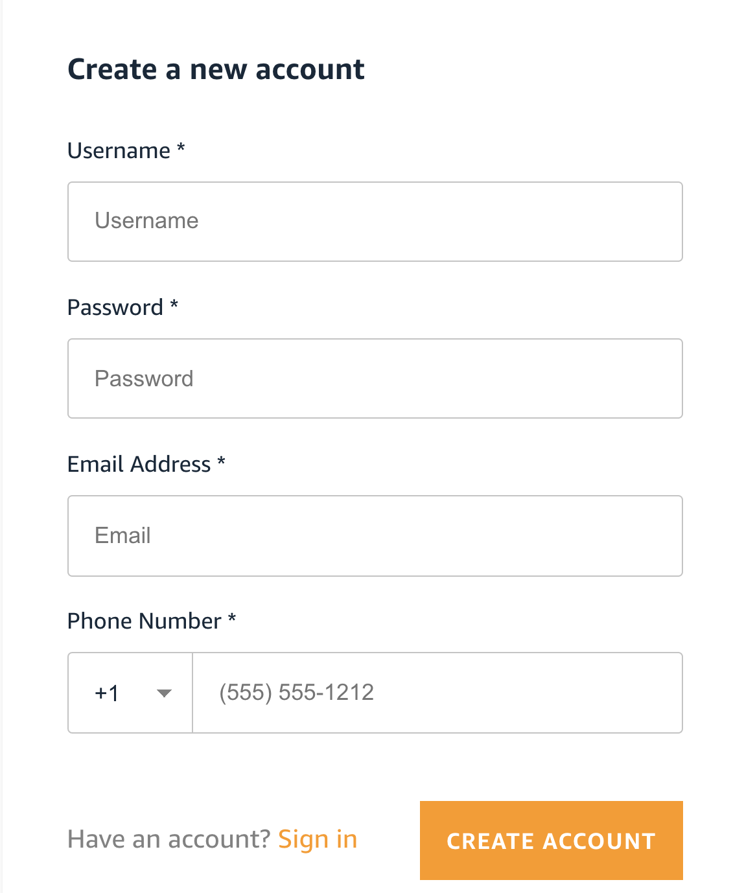
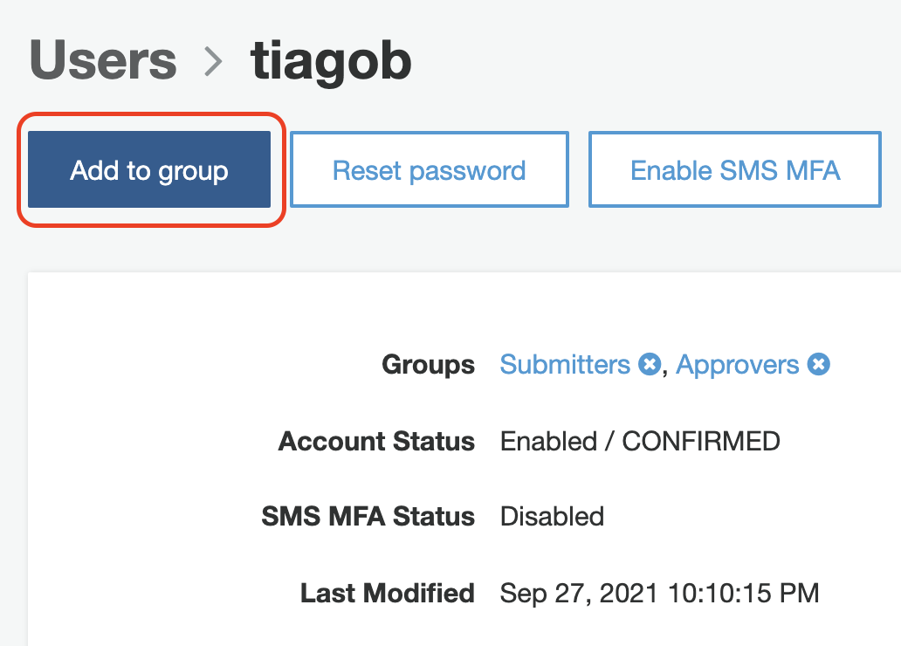

# Event-driven architectures - A developer's tale

Event-driven architectures are made up of decoupled components - producers and consumers - which process events asynchronously, ofthen working through an intermediary - event bus.

The concept is not new but as it always development teams to work more independently and platforms to scale and fail better it's becoming a very hot topic in the industry.

**Benefits:**

- Decoupling systems
- Scaling and failing independently
- Development agility
- Auditing and access control
- EventStore: archiving and replaying
- Cost (being push-based is more optimised than pull based mechanisms - messaging queues)

**Challenges**

- Fallacies of distributed computing: latency, failure handling, bandwidth, security, communication
- Synchronous vs asynchronous
- Data consistency
- Complexity
- Observability
- Testing

## _As a developer where do I start?_

It's ok to start directly with code and create a producer and consumer communicating through an event bus if you are just starting with Event-Driven architectures, but that will only support you during the learning process.

When building Event-Driven solutions that will end up in production, you need to understand the event flows, what events will be produced and consumed in your system in order to guarantee success and agility during the development process.

This is not an extensive list but instead some of the relevant topics when starting - *and we ones we discussed during the session*:

- Event Storming (Event modeling)
- Contracts
- Event Types
- Testing
- Observability
- Documentation

### Event Storming

Event storming is an event modeling exercise that allows multi-purpose teams (developers, products owners, business stakeholders and any other role that is relevant for the specific domain) to collaborate on defining the business events that will flow through the system.

There are other alternatives to event storming but from our experience this approach has huge benefits as it uses simple language (coloured stickers) to represent the understanding of everyone participating. There are no technical or business acronyms or terms being used.

The image below is an example of the outcome of the event storming session ran by our team for a very specific flow of creating a vacation request (use case being used as a demo). 



For more details on Event Storming and how to run an event storming session I recommend watching the following session from Alberto Brandolini, the creator of Event Storming.
:movie_camera: [Alberto Brandolini - Event Storming](https://www.youtube.com/watch?v=mLXQIYEwK24)

### Contracts and versions

In decoupled systems, producers and consumers are not aware of each other's state (unless they share database for some valid reason) as producers just send events to an event bus and consumers subscribe to events on that same event bus.

For that reason it's important to have an agreement on the event payload that producers and consumers send or receive from the event bus. This is very important to prevent possible disruptions and breaking changes.

After the initial event schema agreement, events shouldn't change much and if they do there are some best practices to keep in mind:

- **Event usefulness and atomicity** - Events need to be meaningful, self-contained and independent. Rather than representing a simple change of an entity in the data model, they should have a meaningful business context. Choose event consolidation and globalization over granularity.
- **Event stability** - Events once created should ideally change minimally. Effectual changes should always have a business justification.
- **Event efficiency** - Overlapping events should be avoided. Avoid repeating yourself and creating variations of the same concept.
- **Always track version** - Apply exclusively a version-based schema upgrade process. No ad-hoc untracked changes should be possible.
- **Prevent version complexity** - Apply a limited schema version support model by limiting the range of supported versions. This can be a combination of maximum concurrently supported amount of schemas and limitation of the lifecycle for deprecated schemas.
- **Adopt changes in a timely manner** - Apply an agreed grace period for consumers to adopt a new schema version and notify users about it.
- **Commitment to multi-version** - Producer must produce events for every schema version available in the schema registry. If you manage events following previous rules this will always be the latest version.
- **Monitor version usage** - The only way to know if some service is using an older version of your event schema is to monitor usage. This will allow you to decide whether it is ok to deprecate an older version or to notify consumers for the need to upgrade to the latest schema version.
- **Avoid breaking the consumption flow** - Do not force new schema adoption upon consumers unless the grace period is exceeded.
- **Force and validate that new artifacts always use latest schema version** - When releasing a new version of software relying on particular event schemas be it on the producer or consumer side, always check for its compatibility with the latest schema version. This is done by means of testing activities in the build process.
- **Avoid changing semantic meaning between versions** - It is important that semantic meaning does not change between versions of events. There is no easy way for a consumer to understand a semantic meaning change. In the below example, did it get boiling near the thermostat or did the thermostat switch measures from Celsius to Fahrenheit?

    ```python
    event v1 -> { temperature: 27 degrees } 

    event v2 -> { temperature: 82 degrees }
    ```

- **Avoid renaming or removing properties** - Renaming properties has side effects. When using strong schemas, renaming properties require both producers and consumers to upgrade to the latest version and consumers to add support for one additional schema type. Most times this is not an option, and if it is, it will quickly increase the complexity of maintaining all versions for all events.

### Event Types

Once contracts are agreed upon you need to agree on event types and usually we have 2 options:

- **_Fat Events_**: _Fat events_ contain all the fields/properties of the agree event schema. This facilititates consuming services' event processing as they are immediately able to use all the information. At the same time it increases the payload size which might have a performance impact depending on the number of messages being processed.  


  ``` json
  {
    "version": "0",
    "id": "fd79df46-4c34-627a-19af-2e2cb0038a4d",
    "detail-type": "VacationRequestSubmited",
    "source": "VacationTrackerApp",
    "account": "4142091201135",
    "time": "2021-10-13T10:28:15Z",
    "region": "eu-west-1",
    "resources": [],
    "detail": {
      "category": "ANNUAL_LEAVE",
      "description": "new",
      "approvalStatus": "PENDING_VALIDATION",
      "startDate": "2021-10-13Z",
      "endDate": "2021-10-13Z",
      "id": "58aa24fa-872b-4649-ae12-84cfa23e1933",
      "createdAt": "2021-10-13T10:28:13.902Z",
      "updatedAt": "2021-10-13T10:28:13.902Z",
      "owner": "johndoe"
    }
  }
  ```

- **_Thin Events_**: _Thin events_ contain only the essential information for the consumer process to work with. Tipically this is done by only sharing an id and the updated fields. Once the consumer as the ID it is able to query an external service or datastore to enrich the information received.

```json
{
  "version": "0",
  "id": "fd79df46-4c34-627a-19af-2e2cb0038a4d",
  "detail-type": "VacationRequestSubmited",
  "source": "VacationTrackerApp",
  "account": "4142091201135",
  "time": "2021-10-13T10:28:15Z",
  "region": "eu-west-1",
  "resources": [],
  "detail": {
    "approvalStatus": "PENDING_VALIDATION",
    "id": "58aa24fa-872b-4649-ae12-84cfa23e1933"
  }
}
```

### Testing

Testing is very important when building any type of software but when building decouple systems it is key to test services in isolation (unit testing) but also to test their integration (integration testing). This will allow you to understand if the failing mechanisms put in place are actually working as expected.

During this session we didn't dive deep on this topic as we've done in a previous session with Sarah Hamilton and Ben Ellerby from Theodo (see [here](https://www.twitch.tv/videos/1021148848)) where they share best practices for integration testing with Amazon EventBridge.

> :bulb: **Tip**: We recommend you to automate the process as much as possible as setting up integration tests for all the different components of a decoupled system can become expensive if you don't destroy it once the tests have completed. You can use [Serverless Test Tools (by Theodo)](https://github.com/Theodo-UK/sls-test-tools) to ease the process for example.
> If using AppSync pipeline resolvers like we do in the sample application you can use [Amplify AppSync Simulator library](https://github.com/aws-amplify/amplify-cli/tree/master/packages/amplify-appsync-simulator) to test your velocity templates (VTL).

### Observability

Building distributed systems has multiple advantages from a development agility perspective but if you don't have the right set of tools in-place you will lose track of what's happening in your system quickly. Having tools like AWS X-Ray and Amazon Cloudwatch will allow you to have more information about what's happening and quickly solve any issues that are occuring in the platform.



Of course X-Ray and Cloudwatch are the native AWS options but there are other 3rd party solutions and open source projects that might improve help on that task.

### Documentation

Documenting your event schemas is a key part of the development lifecycle and it makes developer's lifes easier for anyone joining the team or trying to build a consumer service. You don't want to depend on _"tribal knowledge"_ when building event-driven systems as they can become complex very fast.

Amazon EventBridge allows you to keep track of all event schema changes in the event schema registry. This can be used as the single source of truth for all your development efforts.



On a previous episode we hosted David Boyne (from AsyncAPI) on [EventBridge Atlas](https://eventbridge-atlas.netlify.app/), an open source project that integrates directly with Amazon EventBridge to provide documentation for all your events (see episode [here](https://www.twitch.tv/videos/1099785590))



## Sample application - Vacation Tracker

>:rotating_light: This sample solution is work in progress and it's only purpose is to showcase an example of building event-driven architectures for this Twitch episode :rotating_light:

This is a sample vacation tracker application that allows users to create vacation requests and approvers will be able to approve them.

This solution is built using events and covers some - but not all - patterns that are common in event-driven architecture. **This should not be used directly in production.**

### Current implementation status

- [x] User Registration using Amazon Cognito
- [ ] Automatically assigning users to groups after registration
- [x] Users are able to create vacation requests
- [x] Users are able to delete existing requests they own
- [x] Approvers are able to delete existing requests from all users
- [x] Approvers are able to approve vacation requests
- [ ] Profile page
- [ ] Teams page
- [ ] People page
- [ ] Setting page
  
### Use case

During the episode we showed a user submiting a new vacation request and a manager approving the request. The below diagram represents the entire event flow and was implemented based on the event storming session.

> Please be aware that features might not be exactly the same as both the code sample and the result from the event storming session are not final.



### Technologies used

For this sample application we used the following set of technologies:

**Backend:**

- Amazon Cognito
- AWS Amplify
- AWS Lambda
- Amazon DynamoDB
- Amazon EventBridge

**Frontend:**

- React
- Tailwindcss

### How to run

1. Clone the project from GitHub
  
   ```bash
   git clone https://github.com/aws-samples/talk-dev-to-me-twitch.git
   ```

2. Navigate to the project's root folder
  
   ```bash
   cd talk-dev-to-me-twitch/event-driven-developers-tale
   ```

3. Initialize Amplify to use your credentials

   ```bash
   amplify init
   ```

4. Install frontend dependencies

   ```bash
   npm install
   ```

5. Install backend dependencies

   ```bash
   npm install functions/createVacationRequest/
   npm install functions/updateVacationRequest/
   npm install functions/vacationRequestValidation/
   ```

6. Publish both backend and frontend
  
   ```bash
   amplify publish
   ```

   You should see an output similar to the one below. Please copy the generated url and store it somewhere safe. You will need it later.

   ```bash
   ...  
   
   You may serve it with a static server:
  
   serve -s build

   Find out more about deployment here:

   https://cra.link/deployment

   ✔ Zipping artifacts completed.
   ✔ Deployment complete!
   https://dev.d1lhx9dm0heri0.amplifyapp.com
   ```

   > If you want to just publish the backend please use _amplify push_ instead.

7. Open **infrastruture/lib/infrastructure-stack.js** and replace the variables in **line 22 and 23** with your own values.

   >You can get the values from the AWS Console.
   >
   > - **TableNameEnv** is the DynamoDB table created by Amplify.
   > - **AppSyncEndpointEnv** is the AppSync endpoint also created by Amplify during previous step. You can get this value from the Settings page on the AppSync service page.

8. Deploy the infrastructure components using CDK.

   ```bash
   cd infrastructure
   npm install
   cdk deploy
   ```

   You should now see a new Event Bus deployed in Amazon EventBridge and 3 Lambda Functions corresponding to the creation, update and validation process of our workflow.

9.  Open the public endpoint retrieved on **step 5**.

10. Register as a user of the platform
  
   

11. Navigate to Amazon Cognito on the console, create 2 groups (**Approvers** and **Submiters**) and add your new user to one of these groups
  
  

  > You need to be part of the _Approvers_ group to be able to approve vacation requests.

12. Refresh the vacation tracker app and you should be able to use it
