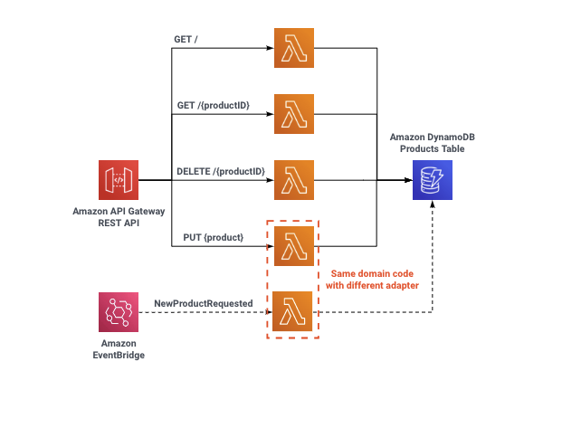

# Serverless Typescript Demo

<p align="center">
  
</p>

This is a simple serverless application built in Typescript and uses Node.js 14 runtime. It consists of an
[Amazon API Gateway](https://aws.amazon.com/api-gateway/) backed by four [AWS Lambda](https://aws.amazon.com/lambda/)
functions and an [Amazon DynamoDB](https://aws.amazon.com/dynamodb/) table for storage.

## Requirements

- [AWS CLI](https://aws.amazon.com/cli/)
- [SAM CLI](https://docs.aws.amazon.com/serverless-application-model/latest/developerguide/serverless-sam-cli-install.html)
- [Node.js 14](https://nodejs.org/)

## Software

Within `src` folder is the products  project. This project contains all the code for all four Lambda functions.
It uses the [hexagonal architecture](https://www.youtube.com/watch?v=kRFg6fkVChQ) pattern to decouple the entry points, from the main domain logic and the storage logic.


### Deployment

Deploy the demo to your AWS account using [AWS SAM](https://docs.aws.amazon.com/serverless-application-model/latest/developerguide/serverless-getting-started.html).

```bash
npm install
npm run build
sam deploy --guided # if running for the first time. Otherwise you can ignore the '--guided' parameter
```

The `npm run build` commmand will first build the products TypeScript project. Then the command `sam deploy` use the SAM Template to deploy the resources to your account.

SAM will create an output of the API Gateway endpoint URL for future use in our load tests.

## License

This library is licensed under the MIT-0 License. See the LICENSE file.
