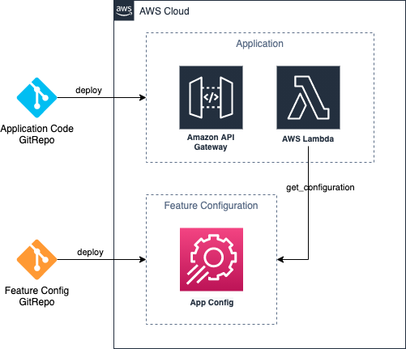

# AWS Lamda Powertools Feature Flags

In this session we will discuss what feature toggles are, when to use them, what are the best practices and how to
implement it by using AWS Lambda Powertools.

The example project contains the application we will use to showcase the feature toggle functionality and the feature
configuration repository.

## Architecture overview
How does it work?



In this example we have an application using Amazon API Gateway and AWS Lambda. 
We split between application and feature configuration by using AWS AppConfig service and store the feature configuration in [AWS AppConfig hosted configuration store](https://docs.aws.amazon.com/appconfig/latest/userguide/appconfig-creating-configuration-and-profile.html#appconfig-creating-configuration-and-profile-about-hosted-store). 
This option comes with some limitation but hat is completly free, [see docs for more details](https://docs.aws.amazon.com/appconfig/latest/userguide/appconfig-creating-configuration-and-profile.html).
There are also other options to host your configuration while using AWS AppConfig feature flags. 

This enables us to deploy code and configuration independently so that we can change functionality wihtout deploying the code. 
Be aware that this also introduce additional complexity and friction, see Best Practices section to get a better grip on challenges.

## Available Feature Flags

* Static flags: response for all requests
* Dynamic or smart flags: change flag based on specific users or tenants

### Schema

The schema document describes the features we want to use in our application. 
It has a name, a default value, and optional rules that will be evaluated. 
In this example we have two features one static `tier_feature` that will always be `true` and one dynamic `premium_feature` that is only true if the provided context during the evaluation is `{"tier": "premium"}`.
You can have multiple rules and and multiple condition, but don't overdo it too much, because it can become complicated very quickly.

For more details check the [documentation](https://awslabs.github.io/aws-lambda-powertools-python/latest/utilities/feature_flags/) of the AWS Lambda Powertools Feature Flags utility.

```json
{
  "premium_features": {
    "default": false,
    "rules": {
      "customer tier equals premium": {
        "when_match": true,
        "conditions": [
          {
            "action": "EQUALS",
            "key": "tier",
            "value": "premium"
          }
        ]
      }
    }
  },
  "tier_feature": {
    "default": true
  }
}
```

## Getting started


### AppConfig Store

First you need to deploy the AppConfig feature configuration. You can use the a CloudFormation or the CDK for that. 

```bash
cd app-config-store/cd
npm install
npm run build
cdk deploy
```

This will create a feature configuration stored in AppConfig. 

### Application using feature flags

In the `app` directory you will find a simple serverless app, build with AWS SAM, with Amazon API Gateway and AWS Lambda function serving static content under `/products` API.
See the README for further instruction how to build, test and deploy.

## Feature flags take aways

### Use cases 

* Deploy without feature available to user -> Dark Launch
* Test featuers on a subset of users or region
* Collect data and metrics in production
* disable non essential parts in cirtical situations (automate it!)

### Challenges

* keep the complexity and the number of features low
* document features for humans
* establish mechanism for schema evolution
* test rules and conditions before deployment

### Best practices

* similar to other cross cutting concerns, try to standardise to reduce cognitive load
* start small when introducing feature toggles
* keep toggle scope and complexity low
* clean up regulary and stive to keep the number of toggles low
* promote features flags to code after some time
* reduce the number of toggle points within the code base
* establish sane defaults for a fallback mechanism
* document for humans

