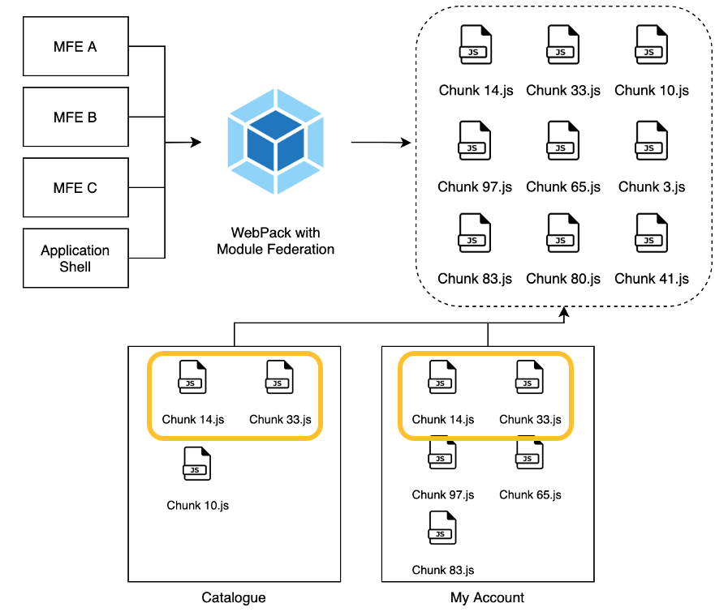
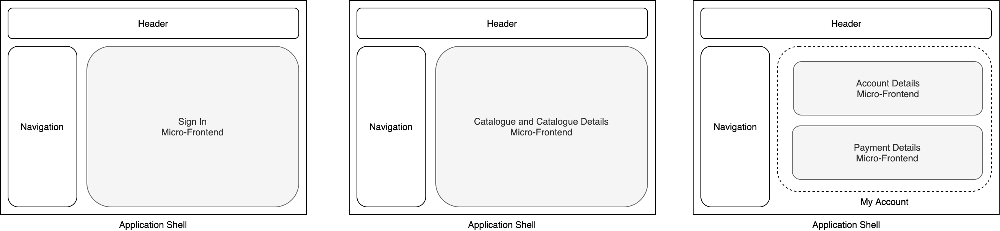

# Micro-Frontends with Module Federation

## Micro-Frontends definition

Micro-Frontends are the **technical representation of a business subdomain**, they allow **independent implementations** with the **same or different technology**.

Finally, they should **minimize the code shared** with other subdomains and they are **own by a single team**

### Module Federation

[Module federation](https://webpack.js.org/concepts/module-federation/) is a webpack plugin. It allows a JavaScript application to dynamically run code from another bundle/build, on both client and server.

### UI example
In this example we are going to create:     

- an application shell for hosting all the micro-frontends
- a sign in micro-frontend
- a catalogue micro-frontend with multiple views
- a my account micro-frontend that is loading 2 micro-frontends: account details and payments details

